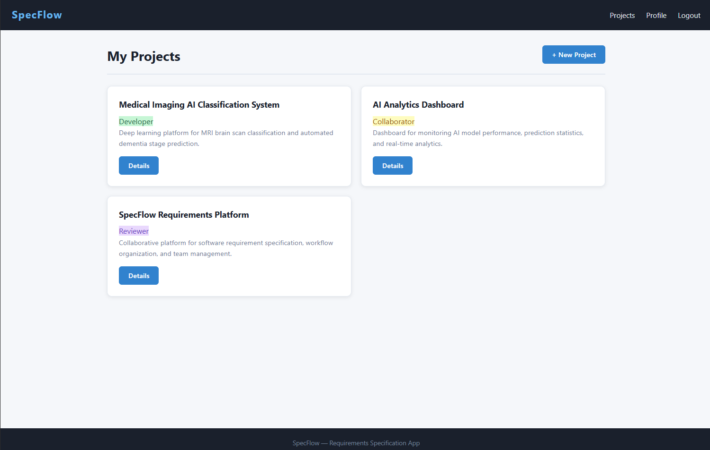
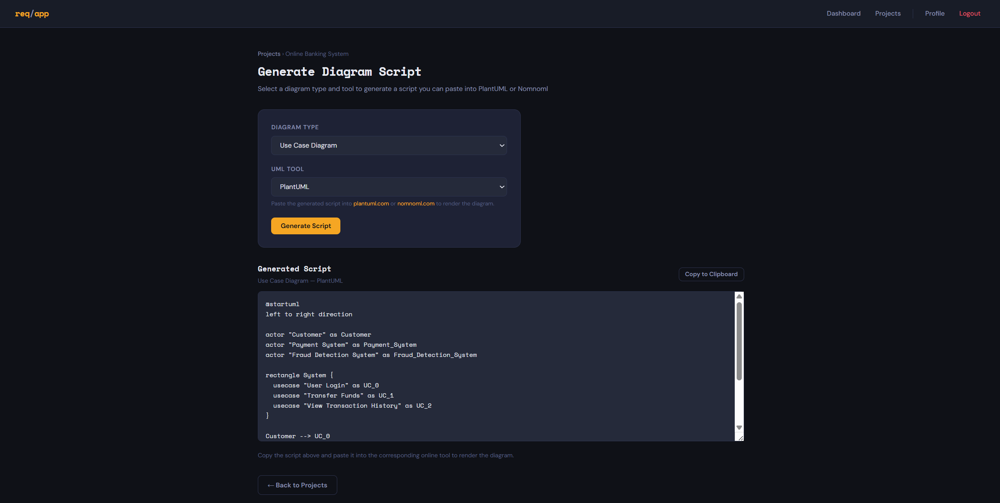

  

<h1 align="center">🚀 SpecFlow</h1>

  A web-based platform for structured <b>software requirements management</b>

---

## 📚 Table of Contents

- [Overview](#-overview)
- [Key Features](#-key-features)
- [Architecture](#-architecture)
- [Design Patterns](#-design-patterns)
- [Technologies](#-technologies)
-  [Screenshots](#️-screenshots)

---

## 📌 Overview

**SpecFlow** is a complete web application designed for software development teams and organizations that struggle with scattered and unstructured requirements.

Instead of managing system requirements across fragmented emails, local documents, and notes, SpecFlow aggregates everything into a centralized, structured, and collaborative workspace. It enables teams to write, review, and approve Use Cases and CRC Cards while automatically generating visual diagrams for their specifications.

---

## 🧠 Key Features

- **Project & Role Management:** Create projects, manage participants, and enforce role-based access control (Organization Owner, Developer, Collaborator, Reviewer, Admin).
- **Use Case Management:** Full lifecycle management of Use Cases including Preconditions, Main/Alternative flows, and Postconditions.
- **Approval Workflow:** Strict verification loop where the Organization Owner can `APPROVE` or `REJECT` requirements, utilizing a dedicated Rejection Reason Dialog.
- **CRC Cards Modeling:** Visually map system classes, their responsibilities, and structural collaborations, linking them directly to Use Cases.
- **Team Collaboration & History:** Threaded comments for granular feedback and continuous event-logging (tracking who changed what and when) with rollback capabilities.
- **Automated Diagram Generation:** Instantly compile Use Cases and CRC cards into scripting languages for automatic visual diagram generation.

---

## 🏗️ Architecture

SpecFlow is built on a highly decoupled **Layered Architecture** adhering to Clean Code fundamentals and the Separation of Concerns (SoC) principle:

1. **UI / HTTP Layer (Controllers):** Handles incoming HTTP requests and web traffic, completely isolated from storage concerns.
2. **Business Logic Layer (Services):** Captures the transactional core of the platform, processing validation rules, permissions, and business workflows.
3. **Data Access Layer (Repositories):** Powered by Spring Data JPA, isolating persistent database operations from business execution routines.
4. **Domain Layer (Entities):** The core Object Model mappings (e.g., `User`, `Project`, `UseCase`, `Actor`, `CrcCard`, `Participant`).
5. **DTO Layer (Data Transfer Objects):** Facilitates safe data transit between controllers and service components, enforcing input validation and hiding database schemas.
6. **Exceptions Layer:** A centralized error infrastructure managed globally by a `GlobalExceptionHandler` for uniform error responses.
7. **Security Layer:** A robust framework utilizing session-based security, CSRF defenses, and cryptographic password hashing.

---

## 🎨 Design Patterns

To maintain maximum flexibility and adhere to the Open/Closed Principle, SpecFlow incorporates modern design patterns:

- **Strategy Pattern:** Utilized within the Diagram Generation engine. This encapsulates rendering formats as interchangeable objects, allowing the application to export diagrams in different syntaxes (such as **PlantUML** and **Nomnoml**). If the team decides to support a new format (e.g., Mermaid) in the future, it can be seamlessly added by defining a new strategy class without altering the core business logic.

---

## 💻 Technologies

The platform leverages a robust tech stack to ensure high performance and security:

**Backend & Frameworks**

- **Java 17+** (Core programming language)
- **Spring Boot** (Application framework)
- **Spring Security** (Authentication & Authorization)
- **Spring Data JPA / Hibernate**

**Database**

- **MySQL 8.0+** (Relational Database Management System)

**Frontend & Templates**

- **HTML**

---

## 🖼️ Screenshots

<table width="100%">
  <tr>
    <th width="50%" align="center"><b>Project Dashboard</b></th>
    <th width="50%" align="center"><b>Automated Diagram Generation Panel</b></th>
  </tr>
  <tr>
    <td align="center">
      
    </td>
    <td align="center">
      
    </td>
  </tr>
  <tr>
    <td>
      Displays the <code>Project List</code> dashboard where authenticated team members can view, browse, and coordinate their active requirements workspaces based on their specific roles.
    </td>
    <td>
      Displays the <code>Generate Diagrams</code> interface, allowing users to view the dynamically compiled technical scripts for their specified requirements.
    </td>
  </tr>
</table>
